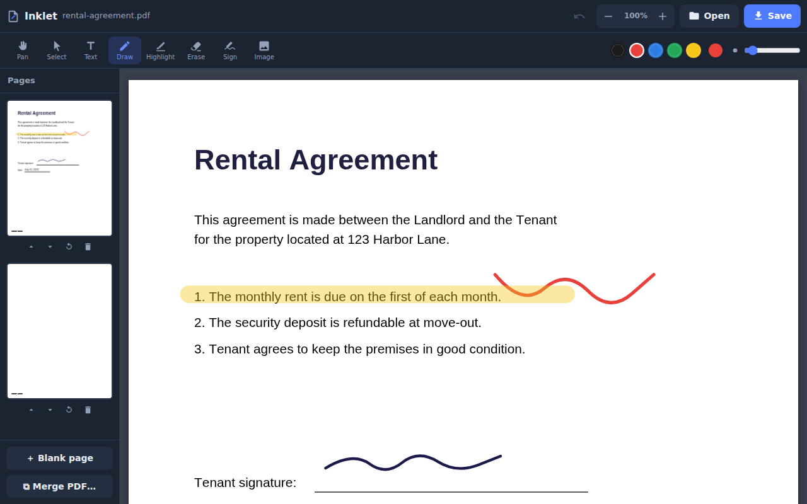

# Inklet — free web-based PDF editor

Inklet is a free, open-source PDF editor that runs entirely in your browser.
There is no server, no account, and no upload: your documents never leave your
device. It works on phones, tablets, and desktops.



## Features

- **Open any PDF** — file picker or drag & drop (hold <kbd>Shift</kbd> while
  dropping to merge into the open document)
- **Text** — tap anywhere to type; move, recolor, and resize afterwards
- **Draw & highlight** — smooth freehand ink and a translucent highlighter,
  with color swatches and adjustable stroke width
- **Whiteout** — drag a patch over anything (a wrong name, an old address),
  then type the correction on top with the Text tool
- **Signatures** — draw your signature on a pad, then tap to place it
- **Images** — insert PNG/JPEG images (logos, stamps, photos)
- **Select / move / resize / erase** any annotation, with full undo
- **Page tools** — reorder, rotate, delete, add blank pages, merge PDFs
- **Mobile-first** — touch drawing, pinch zoom, bottom toolbar, page drawer
- **Real PDF output** — annotations are exported as vector/text/image content
  with pdf-lib, not screenshots of the page

## Using it

It's a static site — any web server works:

```bash
git clone https://github.com/billybbuffum/pdf-editor.git
cd pdf-editor
python3 -m http.server 8000   # or: npx serve
# open http://localhost:8000
```

### Free hosting on GitHub Pages

The editor is live at **https://billybbuffum.github.io/pdf-editor/**.

The site is served from the `gh-pages` branch; the deploy workflow
(`.github/workflows/deploy.yml`) force-syncs that branch on every push to
`main`, so deployments are automatic.

## How it works

Everything is client-side JavaScript — no build step, no framework:

| Piece | Role |
| --- | --- |
| [pdf.js](https://mozilla.github.io/pdf.js/) (vendored) | renders pages to canvas |
| [pdf-lib](https://pdf-lib.js.org/) (vendored) | rebuilds & saves the edited PDF |
| `js/app.js` | annotation model, tools, touch input, export pipeline |

Annotations live on a transparent overlay canvas above each rendered page.
On save, the document is reassembled (page order/rotation) and annotations
are drawn into it as real PDF content. See [docs/DESIGN.md](docs/DESIGN.md)
for the architecture, coordinate math, and roadmap.

## Privacy

Files are read with the `FileReader` API and processed in memory in your
browser tab. Nothing is sent over the network — the app even works offline
once loaded, since both libraries are vendored locally.

## Limitations (v1)

- Existing PDF text can be covered or annotated, but not directly rewritten
  (true content editing is on the roadmap)
- Whiteout is a visual cover, **not redaction** — the original text remains
  in the file and can be recovered (e.g. by copy-pasting). Don't rely on it
  for sensitive information.
- Text annotations use Helvetica; characters outside Latin-1 are replaced
  with `?` on export
- Password-protected PDFs are not supported

## License

MIT. Vendored libraries keep their own licenses (pdf.js: Apache-2.0,
pdf-lib: MIT).
